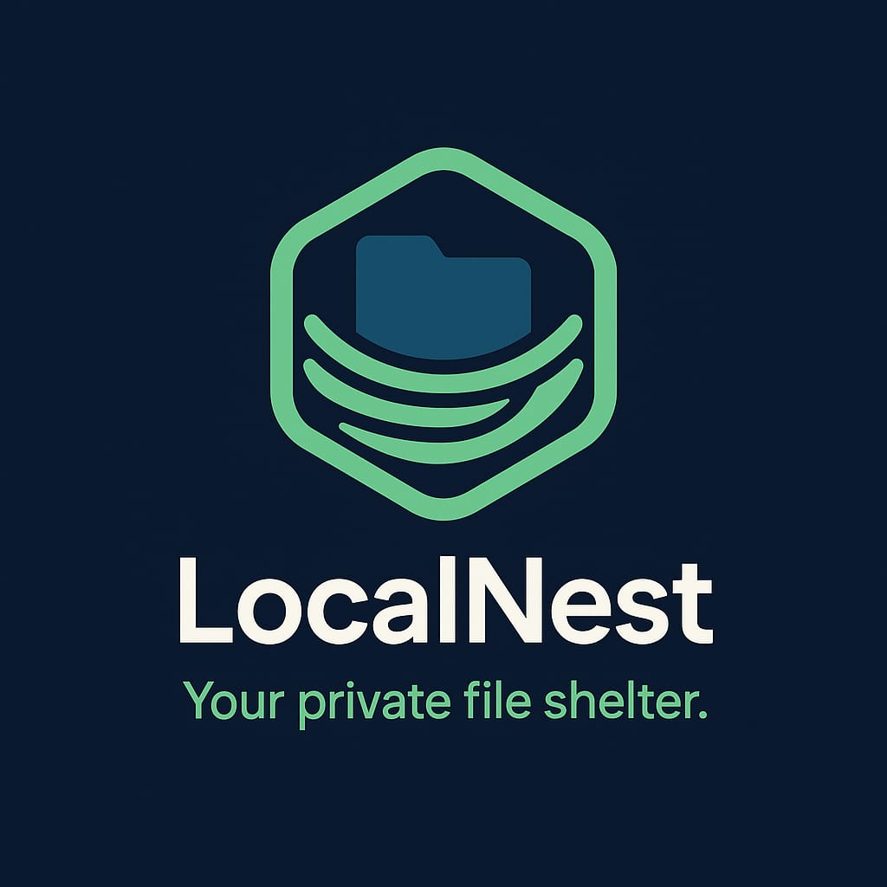

<h1 align="center"> LocalNest </h1> <br>
<p align="center">
    
</p>

<p align="center">
  LocalNest — Your private file shelter.
</p>

---

# Patch di Sicurezza

- Sicurezza migliorata contro vulnerabilità IDOR
- Separazione del database e dei file nel filesystem tramite `docker-compose.yml`

---

## Stato originale del codice

Inizialmente il progetto era funzionante, ma vulnerabile agli attacchi **IDOR (Insecure Direct Object Reference)**. Gli endpoint `/download/<file_id>` e `/delete/<file_id>` permettevano a un utente non autenticato di accedere o cancellare file **di altri utenti** semplicemente conoscendo l'ID del file.

---

## 🗄️ Struttura del Database

Il database dell'applicazione è composto da due tabelle principali: `users` e `files`. Queste tabelle sono collegate da una relazione uno-a-molti: ogni utente può caricare più file, ma ogni file appartiene a un solo utente.

---

### 👤 Tabella `users`

Questa tabella memorizza le informazioni degli utenti registrati.

| Campo      | Tipo      | Descrizione                           |
|------------|-----------|----------------------------------------|
| `id`       | INTEGER   | Identificatore univoco (PK, autoincrement) |
| `username` | TEXT      | Nome utente (unico e obbligatorio)    |
| `email`    | TEXT      | Indirizzo email (unico e obbligatorio) |
| `password` | TEXT      | Hash della password                   |

---

### 📁 Tabella `files`

Questa tabella memorizza i file caricati dagli utenti.

| Campo              | Tipo      | Descrizione                                                      |
|--------------------|-----------|-------------------------------------------------------------------|
| `id`               | INTEGER   | Identificatore univoco del file (PK, autoincrement)              |
| `user_id`          | INTEGER   | Riferimento all'utente proprietario del file (FK)                |
| `filename`         | TEXT      | Nome effettivo salvato sul server (con UUID per evitare conflitti) |
| `original_filename`| TEXT      | Nome originale del file fornito dall'utente                      |

- La relazione tra le due tabelle è realizzata tramite la chiave esterna `user_id`, che punta a `users.id`.
- Le opzioni `ON DELETE CASCADE` e `ON UPDATE CASCADE` garantiscono che le modifiche o eliminazioni degli utenti vengano propagate correttamente ai relativi file.

---

### Codice vulnerabile

```python
@app.route('/download/<path:file_identifier>')
def download_file(file_identifier):
    conn = get_db_connection()
    file = conn.execute('SELECT filename, original_filename FROM files WHERE id = ?', (file_identifier,)).fetchone()
    conn.close()
    ...
```

```python
@app.route('/delete/<int:file_id>', methods=['POST'])
def delete_file(file_id):
    conn = get_db_connection()
    file = conn.execute('SELECT filename FROM files WHERE id = ?', (file_id,)).fetchone()
    ...
```

**Problema**: Nessun controllo viene fatto per verificare che il `file_id` appartenga all'utente autenticato.

---

## Mitigazione della vulnerabilità IDOR

Corretto entrambe le route aggiungendo un controllo sull'`user_id` salvato nella sessione.
Inoltre è stato rimosso il blocco di codice che permetteva di scaricare i file utilizzando il nome esatto del file.
Ora è possibile scaricare il file soltanto tramite richiesta al DataBase.

### Codice corretto – download

```python
@app.route('/download/<int:file_id>')
def download_file(file_id):
    if 'user_id' not in session:
        return redirect(url_for('login'))

    conn = get_db_connection()
    file = conn.execute(
        'SELECT filename, original_filename FROM files WHERE id = ? AND user_id = ?',
        (file_id, session['user_id'])
    ).fetchone()
    conn.close()

    if not file:
        return "File non trovato o accesso non autorizzato", 404

    file_path = os.path.join(app.config['UPLOAD_FOLDER'], file['filename'])
    return send_file(file_path, as_attachment=True, download_name=file['original_filename'])
```

### Codice corretto – delete

```python
@app.route('/delete/<int:file_id>', methods=['POST'])
def delete_file(file_id):
    if 'user_id' not in session:
        return redirect(url_for('login'))

    conn = get_db_connection()
    file = conn.execute(
        'SELECT filename FROM files WHERE id = ? AND user_id = ?',
        (file_id, session['user_id'])
    ).fetchone()
```

Con queste modifiche, un utente potrà accedere solo ai **propri file**, impedendo quindi qualsiasi accesso non autorizzato tramite manipolazione dell'URL.

---

## 🔒 Modifica alla struttura dei file

Per motivi di sicurezza, il file del database è stato spostato da:

```
app/data/database.db  
```

a:

``` 
app/database.db  
```

Questa modifica evita di salvare il database nella stessa cartella utilizzata per i file caricati dagli utenti, riducendo il rischio di accessi non autorizzati o sovrascritture accidentali.

Per migliorare l'organizzazione del filesystem e risolvere il problema di accesso non autorizzato al DataBase, è stato modificato il path del DB nel file `docker-compose.yml`:

### Prima:
```yaml
volumes:
  - ./app/data:/app/data:z # file e DB
```

### Dopo:
```yaml
volumes:
  - ./app/data:/app/data:z # Per i file caricati
  - ./app/database.db:/app/database.db:z # Per il database SQLite
```

Questo permette di separare chiaramente la directory dell'applicazione dai dati caricati dagli utenti, evitando di mescolare file caricati con il database nella stessa cartella.

---

## Avvio del progetto

1. Clona il repository:
```bash
git clone https://github.com/Vito-M/idor-fix.git
cd idor-fix
```

2. Avvia con Docker:
```bash
docker-compose up --build
```

3. Accedi via browser su `http://localhost:5000`.

---

## Sicurezza

- Tutti i file sono associati all’utente loggato.
- Le sessioni sono protette con `secrets.token_hex(32)`.
- Le password sono salvate in modo sicuro con `werkzeug.security.generate_password_hash`.
- I file sono persistenti e accessibili grazie al volume `./app/data:/app/data:z`, dove `:z` garantisce la  corretta etichettatura dei permessi SELinux nei sistemi che lo usano.

---

# 👤 Autore  

**Nome:** Vito Marchionna  
**Email:** [v.marchionna@studenti.uniba.it](mailto:v.marchionna@studenti.uniba.it)  
**Università:** Università degli Studi di Bari Aldo Moro  
**Corso:** ITPS (Informatica e Tecnologie per la Produzione del Software)

Per dubbi sul funzionamento, contattami pure via email!
