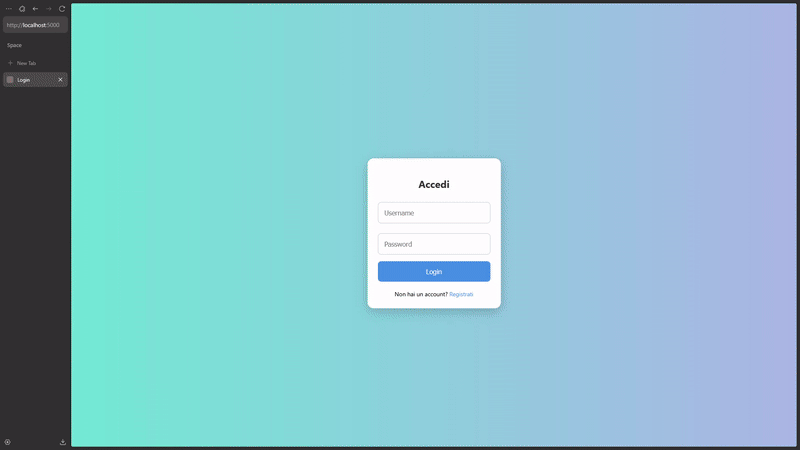

<h1 align="center"> LocalNest </h1> <br>
<p align="center">
    
</p>

<p align="center">
  LocalNest — Your private file shelter.
</p>

## 📖 Introduzione

Questa applicazione web consente di **immagazzinare e scaricare file di qualsiasi tipo** in modo semplice e sicuro su un **server locale**, rendendola ideale per ambienti controllati come reti interne o laboratori didattici.

Attraverso un sistema di **registrazione e login**, ogni utente può accedere alla propria area personale, **caricare file** e **scaricarli in ogni momento**. L'interfaccia è stata progettata per essere **intuitiva** e **facile da usare**, anche per utenti non esperti.

L’archiviazione dei dati avviene **localmente**, utilizzando **SQLite** come database e **Flask** come framework web, il tutto containerizzato con **Docker** per facilitare l’esecuzione e la portabilità dell'applicazione.  
Il progetto è stato sviluppato con finalità **didattiche** ed è completamente **open source**.

---

**✅ Compatibile con macOS, Windows, Linux, iPhone e Android.**

<p align="center">
  
</p>

<p align="center">
  
  
  
  
  
  
</p>

---

## 🚀 Tecnologie Utilizzate

Questo progetto utilizza diverse tecnologie moderne per costruire un'applicazione web sicura, portabile e facilmente manutenibile.

---

### 🐍 Python (Flask)  
  


- **Python** è il linguaggio principale utilizzato per lo sviluppo dell'applicazione.
- **Flask** è un micro-framework leggero ma potente per la creazione di API REST e web app.

---

### 🗄️ SQLite  


- Sistema di gestione di database relazionali, leggero e senza necessità di server esterni.
- Utilizzato per salvare informazioni su utenti e file caricati.

---

### 🌐 Tecnologie Frontend

<div align="center">
  
  
  
</div>

#### Funzionalità implementate:
- **Interfaccia responsive** con HTML5 semantico e CSS3 moderno (Flexbox/Grid)
- **Modali interattivi** per dialoghi e contenuti temporanei
- **Toast notifications** per feedback all'utente
- **Gestione eventi** e dinamismo della pagina

## 🔲 1. Modale (Modal)

### 📋 Cosa fa?
La modale è una finestra di dialogo sovrapposta al contenuto principale della pagina. Viene utilizzata per chiedere all’utente una conferma prima di eseguire un’azione importante, come **eliminare un file**.

### 💡 Funzionalità
- **Conferma azione critica**: mostra un messaggio tipo "Sei sicuro di voler eliminare questo file?".
- **Interrompe la navigazione finché l’utente non risponde**.
- **Due opzioni**:  
  - `Elimina` – conferma l’azione e invia il form di cancellazione  
  - `Annulla` – chiude la modale senza effettuare alcuna azione

### 🧱 Struttura HTML
```
<div class="modal" id="deleteModal">
    <div class="modal-content">
        <p>Sei sicuro di voler eliminare questo file?</p>
        <div class="modal-buttons">
            <button class="btn-confirm">Elimina</button>
            <button class="btn-cancel">Annulla</button>
        </div>
    </div>
</div>
```

### 🎨 Stile CSS Principale
- Posizionata in modo fisso (`position: fixed`) su tutto lo schermo con uno sfondo semi-trasparente (`rgba(0,0,0,0.5)`).
- Al centro dello schermo con `display: flex`, `justify-content` e `align-items`.
- Bottone rosso per confermare, grigio per annullare.

### ⚙️ JavaScript
Gestisce:
- L’intercettazione del submit del form di eliminazione
- La visualizzazione della modale
- Il reindirizzamento dell’azione solo se l’utente clicca su “Elimina”

```
document.querySelectorAll(".delete-form").forEach(form => {
    form.addEventListener("submit", function(e) {
        e.preventDefault();
        formToSubmit = form;
        modal.style.display = "flex";
        document.body.style.overflow = "hidden";
    });
});
```

## 🧾 2. Toast Notification

### 📋 Cosa fa?
Il toast è una notifica temporanea che appare sullo schermo per informare l’utente del risultato di un’azione (ad esempio: caricamento o eliminazione di un file riusciti o falliti).

### 💡 Funzionalità
- Mostra un messaggio breve ed evidenziato
- Scompare automaticamente dopo pochi secondi
- Può mostrare due tipi di stato:
  - ✅ **Successo**
  - ❌ **Errore**

### 🧱 Struttura HTML Dinamica
Il toast viene creato dinamicamente tramite JavaScript:

```
const toast = document.createElement('div');
toast.className = `toast ${type}`;
toast.innerHTML = `
    <i class="fa-solid ${type === 'success' ? 'fa-circle-check' : 'fa-circle-xmark'}"></i>
    <span>${message}</span>
`;
document.body.appendChild(toast);
```

### 🎨 Stile CSS Principale
- Fisso in basso al centro dello schermo
- Ha un’animazione di apparizione/scomparsa tramite `opacity`
- Usa le variabili CSS per i colori:
  - Verde per successo (`--success-color`)
  - Rosso per errore (`--danger-color`)

### ⚙️ JavaScript
Viene attivato in base ai parametri dell’URL (es. `?upload=success`), per mostrare un feedback visivo immediato dopo un’azione.

```
if (uploadStatus === 'success') {
    showToast('File caricato con successo!', 'success');
}
```

## ✅ Conclusione

| Componente | Utilizzo | Feedback | Durata | Interattività |
|------------|----------|----------|--------|----------------|
| **Modal** | Per richiedere conferma prima di azioni critiche (es. eliminare un file) | Richiesto | Indefinita fino a risposta | Sì |
| **Toast** | Per mostrare notifiche brevi e automatiche (es. avviso di caricamento completato) | Automatico | Breve (~3 secondi) | No |

Questi due elementi insieme rendono l’interfaccia più **intuitiva**, **sicura** e **user-friendly**, soprattutto in contesti dove si compiono operazioni sensibili come il caricamento e la cancellazione di file.

---

### 🐳 Docker  


- L'applicazione è completamente containerizzata con Docker.
- Garantisce portabilità e semplicità di esecuzione su qualsiasi sistema che supporti Docker.

---

### 🔐 Sicurezza e Gestione File

### `werkzeug.security`

Per proteggere le credenziali degli utenti, l'applicazione utilizza il modulo `werkzeug.security`, che fornisce funzioni per generare e verificare hash sicuri delle password. In particolare, la funzione `generate_password_hash()` trasforma la password in un hash crittografico in **una sola direzione**, rendendo impossibile ricavare la password originale a partire dall'hash. Questo significa che, anche nel caso in cui un attaccante acceda al database, non potrà risalire alle password reali degli utenti.

Al momento del login, la funzione `check_password_hash()` confronta la password inserita con l'hash memorizzato, senza mai dover decifrare nulla. Questo approccio garantisce un livello elevato di sicurezza, rispettando le migliori pratiche nella protezione dei dati sensibili.

```python
from werkzeug.security import generate_password_hash, check_password_hash
```
- Permette di proteggere le password tramite hash sicuri.
- generate_password_hash crea l'hash della password.
- check_password_hash verifica una password rispetto all'hash salvato.

### `uuid`

Durante la fase di test, è emerso un problema critico: quando utenti diversi caricavano file con lo stesso nome, il file caricato per ultimo sovrascriveva il precedente. Questo comportamento causava la perdita di dati e comprometteva l'affidabilità del sistema.

Per risolvere il problema, è stata apportata una modifica alla struttura del database e alla logica di salvataggio dei file. È stato introdotto l'utilizzo del modulo `uuid`, che genera un identificatore univoco per ogni file. Questo identificatore viene concatenato al nome del file originale, garantendo così l’unicità del nome fisico memorizzato, pur mantenendo visibile all’utente il nome originale.

```python
import uuid
```
- Permette di generare identificatori univoci (UUID).
- Utilizzati per assegnare nomi univoci ai file caricati, prevenendo conflitti o sovrascritture.

---

## 🗄️ Struttura del Database

Il database dell'applicazione è composto da due tabelle principali: `users` e `files`. Queste tabelle sono collegate da una relazione uno-a-molti: ogni utente può caricare più file, ma ogni file appartiene a un solo utente.

---

### 👤 Tabella `users`

Questa tabella memorizza le informazioni degli utenti registrati.

| Campo      | Tipo      | Descrizione                           |
|------------|-----------|----------------------------------------|
| `id`       | INTEGER   | Identificatore univoco (PK, autoincrement) |
| `username` | TEXT      | Nome utente (unico e obbligatorio)    |
| `email`    | TEXT      | Indirizzo email (unico e obbligatorio) |
| `password` | TEXT      | Hash della password                   |

---

### 📁 Tabella `files`

Questa tabella memorizza i file caricati dagli utenti.

| Campo              | Tipo      | Descrizione                                                      |
|--------------------|-----------|-------------------------------------------------------------------|
| `id`               | INTEGER   | Identificatore univoco del file (PK, autoincrement)              |
| `user_id`          | INTEGER   | Riferimento all'utente proprietario del file (FK)                |
| `filename`         | TEXT      | Nome effettivo salvato sul server (con UUID per evitare conflitti) |
| `original_filename`| TEXT      | Nome originale del file fornito dall'utente                      |

- La relazione tra le due tabelle è realizzata tramite la chiave esterna `user_id`, che punta a `users.id`.
- Le opzioni `ON DELETE CASCADE` e `ON UPDATE CASCADE` garantiscono che le modifiche o eliminazioni degli utenti vengano propagate correttamente ai relativi file.

---

### 🧱 Esempio di Creazione in Python (SQLite)
```python
def init_db():
    conn = get_db_connection()
    conn.execute('''
        CREATE TABLE IF NOT EXISTS users (
            id INTEGER PRIMARY KEY AUTOINCREMENT,
            username TEXT NOT NULL UNIQUE,
            email TEXT NOT NULL UNIQUE,
            password TEXT NOT NULL
        )
    ''')
    conn.execute('''
        CREATE TABLE IF NOT EXISTS files (
            id INTEGER PRIMARY KEY AUTOINCREMENT,
            user_id INTEGER NOT NULL,
            filename TEXT NOT NULL,
            original_filename TEXT NOT NULL,
            FOREIGN KEY(user_id) REFERENCES users(id) ON DELETE CASCADE ON UPDATE CASCADE
        )
    ''')
    conn.commit()
    conn.close()
```

---

## 📁 Struttura del Progetto
Una panoramica ad albero dei file principali del progetto:
```cpp
idor/
│
├── app/
│   ├── templates/ # Pagine HTML per il FrontEnd
│   │   ├── login.html
│   │   ├── register.html
│   │   └── upload.html
│   ├── data/
│   │   ├── database.db # Database generale
│   │   ├── user1_file1.pdf  # Esempio di file caricato da un utente
│   │   └── user2_image.jpg  # Esempio di file caricato da un utente
│   └── app.py # Applicazione principale
│
├── readmeFile/ # Immagini e GIF per il README
│   └── logo.png
│
├── Dockerfile
├── docker-compose.yml
├── requirements.txt
└── README.md
```

---

## ▶️ Avvio dell'Applicazione

Questa guida ti accompagnerà passo passo nell’avvio del progetto. È pensata per essere semplice anche per chi non ha mai lavorato con Git, Python, Flask o Docker.

---

# Come Scaricare e Installare Git

Git è uno strumento fondamentale per il controllo delle versioni del codice. Questa guida ti mostra come scaricarlo e installarlo sui principali sistemi operativi.

## 🖥️ 1. Scarica Git

Visita il sito ufficiale di Git:  
🔗 [https://git-scm.com](https://git-scm.com) 

Il sito rileva automaticamente il tuo sistema operativo e propone la versione corretta da scaricare.

## 🪟 2. Installazione su Windows

1. **Scarica l'installer**: Clicca sul pulsante "Download" per ottenere il file `.exe`.
2. **Esegui l'installer**:
   - Segui le schermate guidate.
   - Nella schermata "Choosing the default editor", puoi lasciare Notepad come predefinito.
   - Scegli se aggiungere Git al PATH (opzione consigliata: "Use Git from Windows Command Prompt").
3. Al termine, clicca su "Finish".

> ✅ Opzionale: Durante l'installazione, puoi scegliere di installare anche **Git Bash**, un terminale comodo per usare Git come su sistemi Unix.

## 🍎 3. Installazione su macOS

### Opzione A: Usare Homebrew (consigliato)
Se hai [Homebrew](https://brew.sh/)  installato:

```
brew install git
```

### Opzione B: Scaricare l’installer

1. Vai su [https://sourceforge.net/projects/git-osx-installer/](https://sourceforge.net/projects/git-osx-installer/) 
2. Scarica l’ultima versione disponibile.
3. Apri il file `.dmg` e segui le istruzioni per installare Git.

## 🐧 4. Installazione su Linux

### Ubuntu / Debian

Apri il terminale e digita:

```
sudo apt update
sudo apt install git
```

### Fedora

```
sudo dnf install git
```

### Arch Linux

```
sudo pacman -S git
```

## ✅ 5. Verifica l'installazione

Dopo aver installato Git, apri un terminale (o Git Bash) e scrivi:

```
git --version
```

Se vedi qualcosa come `git version 2.xx.x`, allora Git è stato installato correttamente!

## 💡 Suggerimento Finale

Configura subito Git con il tuo nome utente e email:

```
git config --global user.name "IlTuoNome"
git config --global user.email "iltuoemail@example.com"
```

Queste informazioni saranno associate ai tuoi commit.

## 📚 Risorse utili

- [Documentazione ufficiale di Git](https://git-scm.com/book/it/v2) 
- [GitHub Guides](https://guides.github.com/) 
- [Learn Git Branching](https://learngitbranching.js.org/) 

---

# Come Installare Docker

Docker è uno strumento fondamentale per lo sviluppo, il testing e il deployment di applicazioni in ambienti isolati. Questa guida ti mostra come installarlo sui principali sistemi operativi.

## 🖥️ 1. Scarica Docker

Visita il sito ufficiale di Docker:
🔗 [https://www.docker.com/get-started](https://www.docker.com/get-started) 

Da questa pagina potrai scaricare Docker Desktop per Windows o macOS.  
Se sei su Linux, vai direttamente alla sezione dedicata più in basso.

---

## 🪟 2. Installazione su Windows

### Requisiti
- Sistema operativo Windows 10 64-bit
- Abilitare WSL2 (Windows Subsystem for Linux v2)

### Passaggi:

1. Scarica Docker Desktop dal sito ufficiale.
2. Apri il file `.exe` scaricato.
3. Segui le istruzioni dell’installer.
4. Al termine, avvia Docker Desktop e attendi che parta correttamente (può richiedere qualche minuto la prima volta).
5. Verifica che Docker funzioni aprendo PowerShell o CMD e scrivendo:

```
docker --version
```

Dovresti vedere qualcosa come `Docker version 20.x.x, build ````.

> ✅ Consiglio: Assicurati di essere nel gruppo Docker per evitare di usare sempre `sudo`. Puoi verificare digitando:
>
> ```
> docker info
> ```

---

## 🍎 3. Installazione su macOS

### Passaggi:

1. Scarica Docker Desktop per macOS dal sito ufficiale:  
   🔗 [https://www.docker.com/products/docker-desktop/](https://www.docker.com/products/docker-desktop/) 
2. Apri il file `.dmg` scaricato e trascina Docker nell’apposita cartella “Applications”.
3. Fai doppio clic su Docker.app per avviarlo.
4. Segui le indicazioni iniziali e concedi i permessi necessari.
5. Una volta avviato, vedrai l'icona di Docker nella barra del menu.

Per verificare che Docker sia installato correttamente, apri il terminale e digita:

```
docker --version
```

---

# Installazione di Docker su Linux

Questa guida ti mostra come installare Docker velocemente su Linux, con comandi validi per le distribuzioni più comuni.

## 🐧 1. Ubuntu / Debian

Apri il terminale e digita:

```
sudo apt update
sudo apt install docker.io
```

Verifica che sia installato correttamente:

```
docker --version
```

Avvia Docker (se non parte automaticamente):

```
sudo systemctl start docker
```

(Opzionale) Imposta Docker all'avvio:

```
sudo systemctl enable docker
```

## 🐧 2. Fedora / Red Hat (Dnf)

In Fedora, Docker è disponibile tramite `podman`, ma puoi installare Docker Engine ufficialmente così:

```
sudo dnf install dnf-plugins-core
sudo dnf config-manager --add-repo https://download.docker.com/linux/fedora/docker-ce.repo 
sudo dnf install docker-ce docker-ce-cli containerd.io
```

Poi avvia il servizio:

```
sudo systemctl start docker
sudo systemctl enable docker
```

Verifica:

```
docker --version
```

## 🐧 3. Arch Linux (Pacman)

Su Arch Linux puoi installare Docker direttamente da pacman:

```
sudo pacman -Sy docker
```

Avvia Docker:

```
sudo systemctl start docker
```

Abilita l'avvio automatico:

```
sudo systemctl enable docker
```

Verifica:

```
docker --version
```

## ✅ 4. Verifica funzionamento

Prova a eseguire un contenitore di prova:

```
docker run hello-world
```

Se vedi un messaggio di successo, Docker è installato correttamente!

## 💡 Esegui Docker senza sudo (Consigliato)

Aggiungi il tuo utente al gruppo `docker`:

```
sudo usermod -aG docker $USER
```

Riavvia la sessione o usa:

```
newgrp docker
```

---

## 📚 Risorse utili

- [Documentazione ufficiale di Docker](https://docs.docker.com/) 
- [Docker Hub](https://hub.docker.com/) 
- [GitHub - Docker Cheat Sheet](https://github.com/wsargent/docker-cheat-sheet) 

---

### 🐳 Avvio con Docker (Metodo consigliato)

1. **Assicurati che Docker sia installato e in esecuzione.**

2. **Clona e posizionati nella directory del progetto:**
   ```bash
   git clone https://github.com/Vito-M/idor.git
   cd idor
   ```

3. **Costruisci e avvia l'immagine Docker:**
   ```bash
   docker build -t idor .
   docker run -p 5000:5000 idor
   ```
   'idor' è il nome che assegni all'immagine Docker, volendo puoi modificarlo a tuo piacimento.
   Anche la porta sulla quale viene offerto il servizio puoi modificarla in base alle tue esigienze.

4. **Accedi all'applicazione:**
   Apri il browser e vai su:
   ```bash
   http://localhost:5000
   ```

---

### 📦 Prerequisiti

Prima di tutto, assicurati di avere installati sul tuo computer i seguenti strumenti:

- **[Python 3.10+](https://www.python.org/downloads/)**
- **pip** (gestore pacchetti di Python, incluso in Python)

---

# Guida all'Installazione di Python

Python è uno dei linguaggi di programmazione più diffusi al mondo. Questa guida ti mostra come installarlo correttamente su Windows, macOS e le principali distribuzioni Linux.

## 🖥️ 1. Scarica Python

Visita il sito ufficiale:  
🔗 [https://www.python.org/downloads/](https://www.python.org/downloads/) 

Il sito rileva automaticamente il tuo sistema operativo e mostra la versione corretta da scaricare (generalmente Python 3.x).

---

## 🪟 2. Installazione su Windows

### Passaggi:

1. Scarica l’installer da [python.org](https://www.python.org/downloads/windows/) 
2. Apri il file `.exe` scaricato
3. **Importante**: Spunta la casella **"Add Python to PATH"**
4. Clicca su **"Install Now"**

### Verifica l'installazione

Apri **PowerShell** o **CMD** e digita:

```
python --version
```

Dovresti vedere qualcosa tipo `Python 3.x.x`.

> ✅ Consiglio: Se non funziona, prova con:
>
> ```
> py --version
> ```

---

## 🍎 3. Installazione su macOS

macOS ha già Python 2.7 preinstallato (ormai obsoleto), ma puoi installare Python 3 facilmente.

### Opzione A: Usare Homebrew (consigliato)

Se non hai Homebrew, installalo prima:

```
/bin/bash -c "$(curl -fsSL https://raw.githubusercontent.com/Homebrew/install/HEAD/install.sh)" 
```

Poi installa Python:

```
brew install python
```

### Opzione B: Scaricare l’installer

Vai su [https://www.python.org/downloads/macos/](https://www.python.org/downloads/macos/)  e scarica l’installer grafico.

### Verifica

```
python3 --version
```

---

## 🐧 4. Installazione su Linux

La maggior parte delle distro Linux ha già Python installato. Ma se devi aggiornarlo o installarlo manualmente, ecco i comandi per le distro più usate.

### Ubuntu / Debian

```
sudo apt update
sudo apt install python3
```

Verifica:

```
python3 --version
```

### Fedora

```
sudo dnf install python3
```

Verifica:

```
python3 --version
```

### Arch Linux

```
sudo pacman -Sy python
```

Verifica:

```
python --version
```

> Nota: Su Arch, `python` punta direttamente a Python 3.

---

## 📦 5. Gestione pacchetti: pip

Python include **pip**, lo strumento per installare librerie esterne.

Esempio:

```
pip install requests
```

Per aggiornare pip:

```
python -m pip install --upgrade pip
```

> ⚠️ Su alcuni sistemi puoi dover usare `pip3` invece di `pip`.

---

## ✅ 7. Verifica che tutto funzioni

Prova a eseguire un piccolo script:

```
echo "print('Ciao mondo!')" > test.py
python test.py
```

Se vedi `Ciao mondo!`, sei pronto per iniziare a programmare!

---

## 📚 Risorse utili

- [Documentazione ufficiale Python](https://docs.python.org/3/) 
- [Python Tutor](https://pytutor.com/)  – Per comprendere il codice passo dopo passo
- [Real Python](https://realpython.com/)  – Tutorial avanzati
- [Awesome Python](https://awesome-python.com/)  – Lista di librerie fantastiche

---

### 🔧 Installazione Manuale (senza Docker)

1. **Clona e posizionati nella directory del progetto:**
   ```bash
   git clone https://github.com/Vito-M/idor.git
   cd idor
   ```

2. **Crea un ambiente virtuale (opzionale ma consigliato):**
   ```bash
   python -m venv venv
   source venv/bin/activate   # Su Linux/Mac
   venv\Scripts\activate      # Su Windows
   ```

3. **Installa le dipendenze:**
   ```bash
   pip install -r requirements.txt
   ```

4. **Posizionati nella cartella app e avvia l'applicazione:**
   ```bash
   cd app/
   python app.py
   ```

5. **Accedi all'applicazione:**
   Apri il browser e vai su:
   ```bash
   http://localhost:5000
   ```

---

### 🔐 Primo Accesso
- Una volta avviata, l'applicazione mostrerà la pagina di registrazione o login.
- Crea un nuovo utente con nome utente, email e password.
- Dopo l’accesso potrai caricare file in modo sicuro e scaricarli.

---

## 🎥 Demo

<div align="center">
  
  <p><em>Funzionamento del sistema</em></p>
</div>

---

### 🔐 Autenticazione
Il sistema di autenticazione utilizza un approccio tradizionale con username/password:

1. **Registrazione:**
   - L'utente fornisce username, email e password (con conferma)

   - La password viene hashata con generate_password_hash di Werkzeug

   - I dati vengono salvati nel database SQLite nella tabella users

   - Controlli: password coincidenti, username/email univoci

2. **Login:**
   - Verifica delle credenziali con check_password_hash

   - Creazione di una sessione con session['username'] e session['user_id']

   - Le sessioni sono protette da una secret key (app.secret_key)

---

### 📤 Sistema di Upload

1. **Funzionamento:**
   - Gli utenti autenticati possono caricare file tramite una form POST

   - I file vengono ricevuti con request.files['file']

   - Ogni file viene rinominato con un UUID univoco per prevenire collisioni

   - Le informazioni sul file vengono salvate nel database (tabella files)

2. **Salvataggio:**
   - I file vengono salvati localmente nella cartella data/

   - Il database contiene solo i metadati (user_id, nome file generato, nome originale)

   - La relazione tra utenti e file è gestita con foreign key e CASCADE

---

## 🌍 Accesso alla Web App da altri dispositivi (rete locale o server)

Per impostazione predefinita, l'app Flask è già configurata per essere raggiungibile da **qualsiasi dispositivo nella rete**, grazie alla riga presente in `app.py`:

```python
app.run(host='0.0.0.0', port=5000)
```

### 🔎 Come scoprire l'indirizzo IP della macchina
Per accedere all'app da un altro dispositivo nella stessa rete, è necessario conoscere l'indirizzo IP locale del computer/server su cui gira l'applicazione.

Apri il terminale o prompt dei comandi sulla macchina dove è in esecuzione l'app e digita:

### Linux/macOS:
```bash
ip a
```

### Windows:
```bash
ipconfig
```

Cerca la voce corrispondente alla tua rete (es. "Wi-Fi" o "Ethernet") e annota l'indirizzo IPv4, ad esempio:
```bash
192.168.1.42
```
Ora potrai accedere alla Web app da un altro dispositivo con:
```cpp
http://192.168.1.42:5000
```

---

### 🔁 Come cambiare la porta della Web App
Se desideri usare una porta diversa da 5000, puoi modificarla direttamente in app.py, ad esempio:
```python
app.run(host='0.0.0.0', port=8080)
```

### 🐳 Se usi Docker
Assicurati che la porta nel file docker-compose.yml (o nel comando docker run) corrisponda a quella scelta in app.py.
Esempio nel file docker-compose.yml:
```yaml
ports:
  - "8080:8080"
```
La prima porta (8080) è quella esterna, visibile da fuori; la seconda (8080) deve corrispondere a quella impostata in app.py.

Ora potrai accedere alla Web app con la porta:
```cpp
http://localhost:8080
```

### 🔒 Nota sul firewall
Assicurati che il firewall del sistema (se attivo) non blocchi la porta scelta, altrimenti l'app potrebbe non essere accessibile da altri dispositivi.

✅ Ora sei pronto per accedere all'app da altri dispositivi, come smartphone, tablet o PC, collegati alla stessa rete o, in caso di server pubblico, anche via Internet (con i dovuti accorgimenti di sicurezza).

---

# 👤 Autore  

**Nome:** Vito Marchionna  
**Email:** [v.marchionna@studenti.uniba.it](mailto:v.marchionna@studenti.uniba.it)  
**Università:** Università degli Studi di Bari Aldo Moro  
**Corso:** ITPS (Informatica e Tecnologie per la Produzione del Software)

Per dubbi sul funzionamento, contattami pure via email!

---